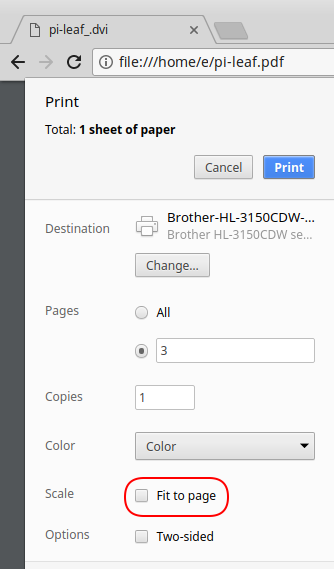

+++
showonlyimage = false
draft = false
image = "img/pileaf.jpg"
date = "2018-12-01"
title = "Raspberry Pi GPIO labelling"
writer = "Martin Strohmayer"
categories = ["Raspberry Pi"]
keywords = ["pileaf", "reference card", "labelling", "gpio"]
weight = 1
+++

Dealing with the unlabelled GPIO pins of the Raspberry Pi can be tricky in the process of building circuits. "Pin-counting" is a typical task when working with these multi-purpose inputs and outputs. Labels or so called "reference cards", that can be put on top the GPIO pin header, may be used to solve the problem.
<!--more-->

## Creation

The GPIO contacts of the Raspberry are not labelled, but you can find reference cards on many Raspberry Pi Shops. They are put over the GPIO connector pins. Of course, these reference cards do not have to be made out of cardboard. They can be easily printed out at home and then cut to size. The holes are best made with a needle. Those reference cards are often available for download as PDF templates, for example at [http://noxmiles.de/Raspberry-Pi-GPIO-Beschriftung.pdf](http://noxmiles.de/Raspberry-Pi-GPIO-Beschriftung.pdf). 
A very interesting option is the project Pi Leaf [https://www.raspberrypi.org/blog/raspberry-leaf](https://www.raspberrypi.org/blog/raspberry-leaf). The graphic is being is defined by a description language. Originally the project was presented on [Dr. Monk's DIY Electronics Blog] (http://www.doctormonk.com/2013/02/raspberry-pi-and-breadboard-raspberry.html) and published on [Sourceforge] (https://sourceforge.net/projects/pileaf/) .

For the outdated project, a fork was created by "Sanderr" on [Sourceforge] (https://sourceforge.net/u/sanderr/pileaf). This version also includes a template for the 40-pin connector of the current Raspberry Pi variants. The description file "pi-leaf.asy" can be used to create the PDF file with the program Asymptote.

```
sudo apt-get install asymptote git
cd /usr/src/
git clone git: //git.code.sf.net/u/sanderr/pileaf u-sanderr-pileaf
cd u-sanderr-pileaf
asy -f pdf pi-leaf.asy
```

A already created PDF template file can be downloaded from our website at [http://raspjamming.at/PDF/pi-leaf.pdf](http://raspjamming.at/PDF/pi-leaf.pdf). When printing (e.g. with the browser Chrome), the setting "Fit to page" must be deactivated!


